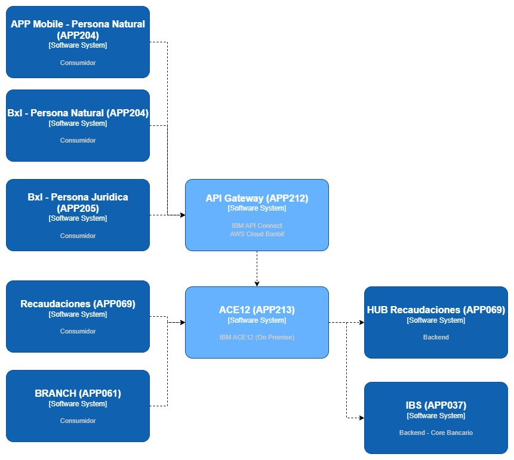
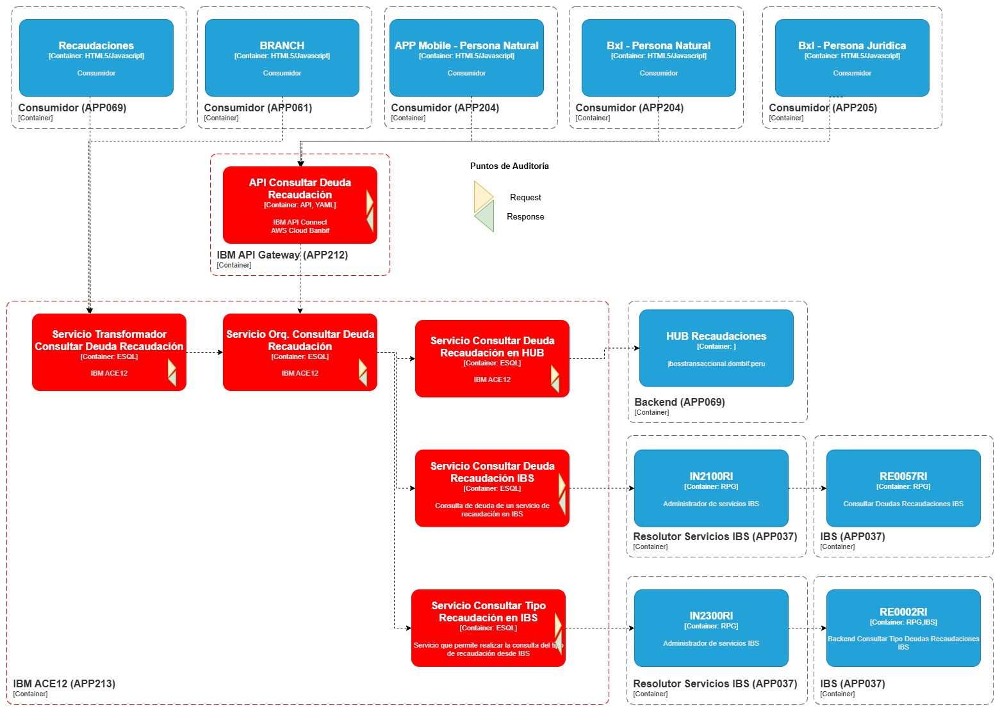
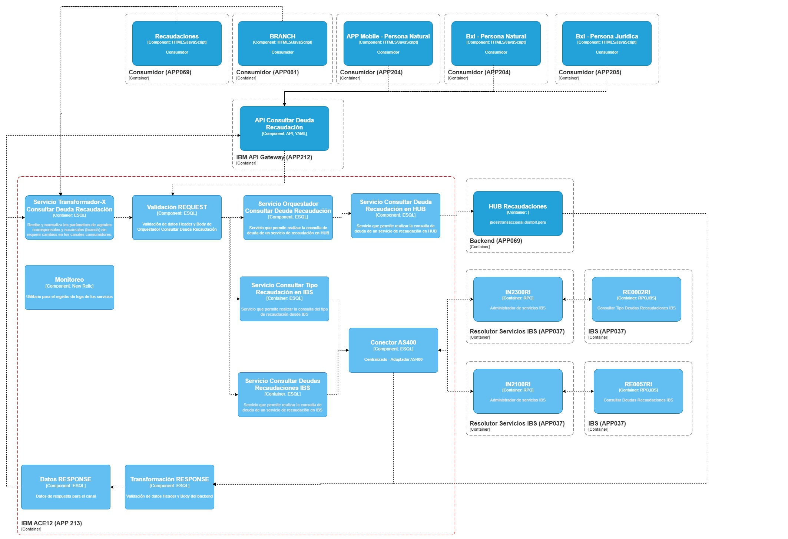
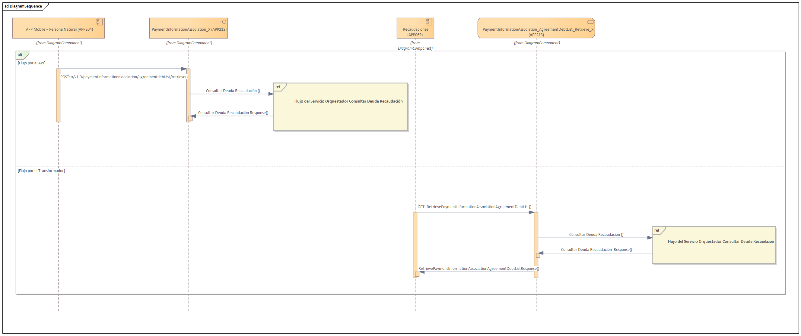
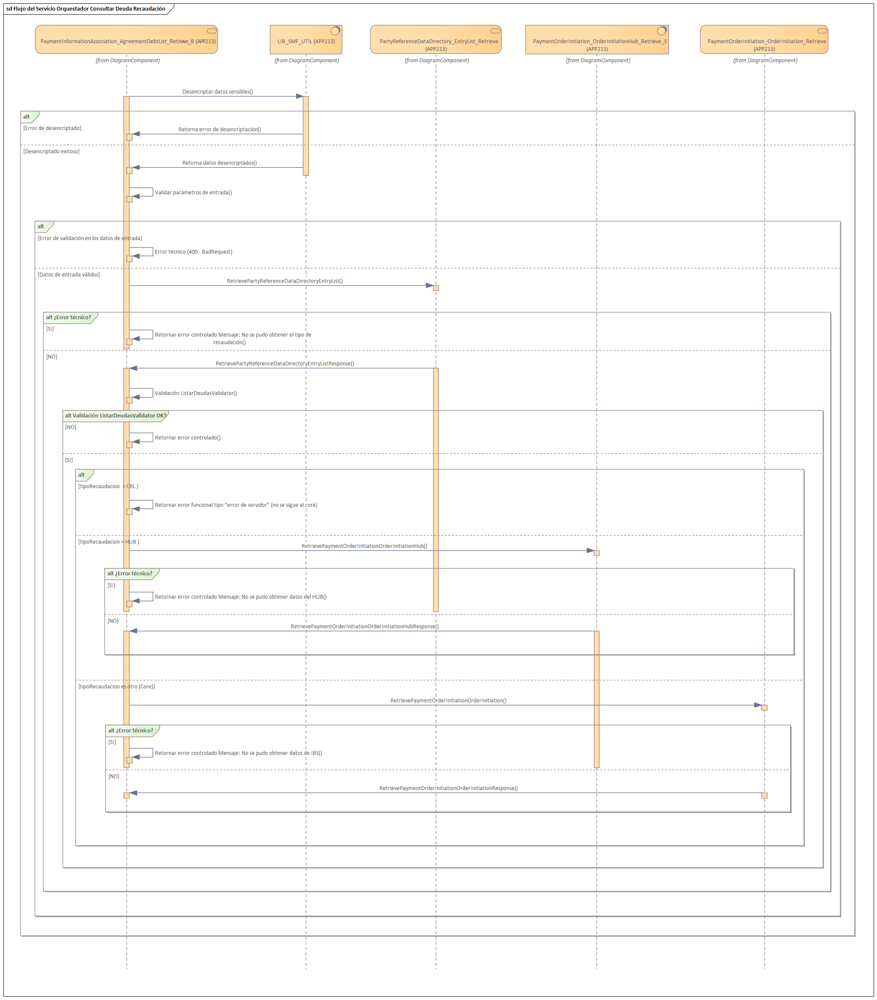
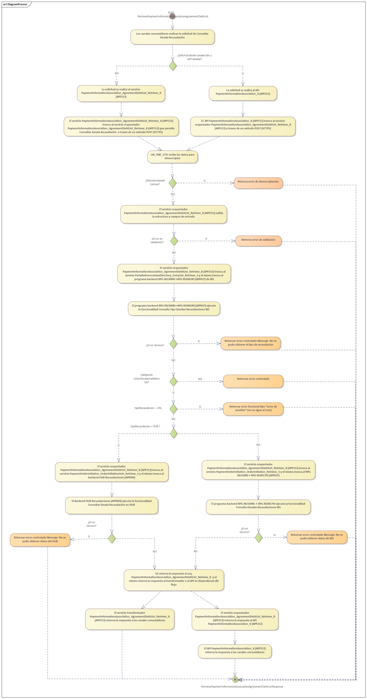
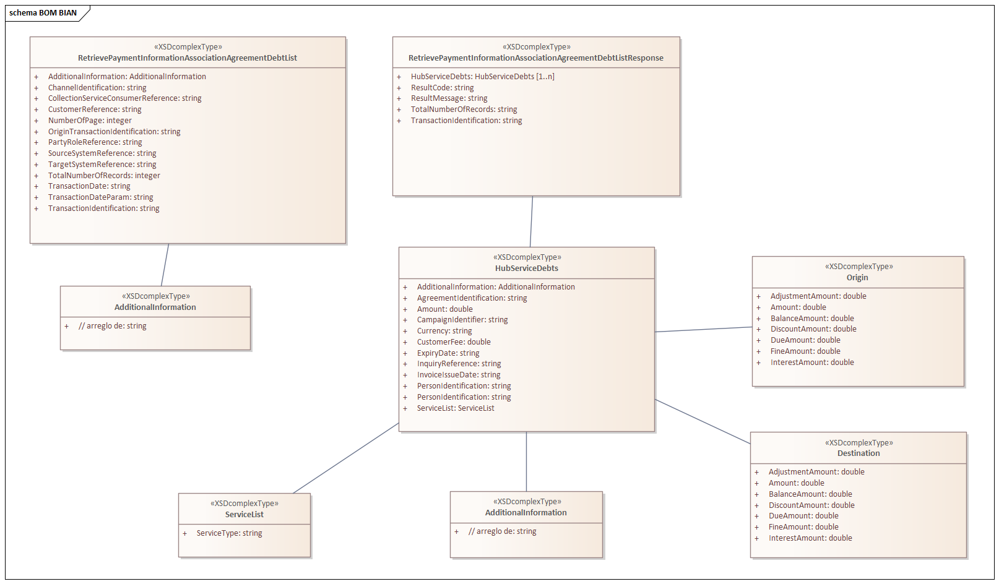
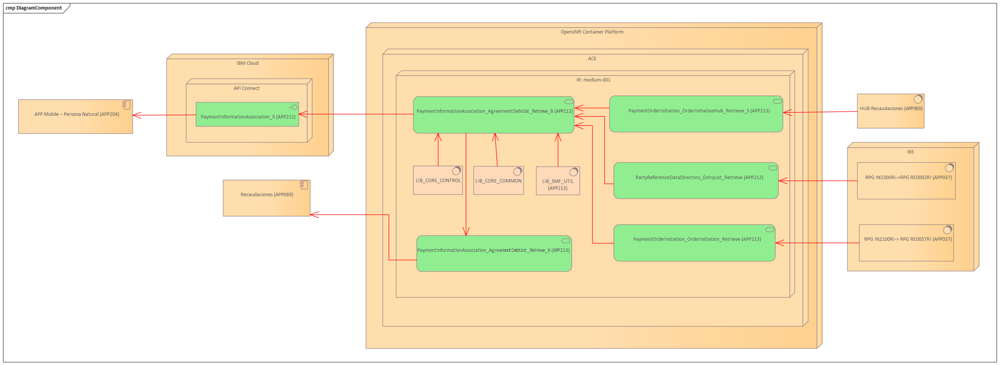
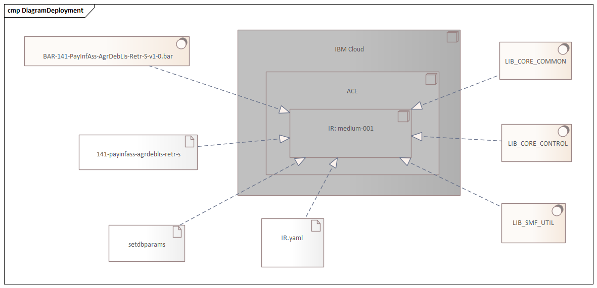

# 141_BUS_Listar_Deudas
# Especificaciones Técnicas de Servicios - ETI

---

## 1. Alcance del Componente Integración

El presente documento tiene como alcance la especificación técnica del `BUS_Listar_Deudas`, que permite realizar la consulta de deuda de un servicio de recaudación, para la consulta es necesario enviar el codigo de convenio (relacionado a la empresa y el tipo de servicio) y número de suministro (recibo, teléfono) desde los origenes IBS y HUB.
`<br>`
`Nota:` El presente documento ha sido elaborado considerando al consumidor `RECAUDACIONES (APP069), BRANCH (APP061), Nueva APP (APP204), BxI PN (APP204) y Banca por Internet - Persona Jurídica (APP205)` como sistema inicial de consumo. Sin embargo, la estructura, lineamientos y definiciones aquí descritas permiten que el servicio pueda ser consumido posteriormente por otros sistemas o aplicaciones que cumplan con los mismos criterios de integración.

---

## 2. Pre-requisitos

| Documento                 | Descripción                                                                                              | Repositorio                          | Responsable                                 |
| ------------------------- | --------------------------------------------------------------------------------------------------------- | ------------------------------------ | ------------------------------------------- |
| `SCI Aprobado  `        | Formato de solicitud de Servicios                                                                         | [SCI_BUS_Listar_Deudas](https://banbifperu.sharepoint.com/:x:/r/sites/EquipoIntegraciones/Documentos%20compartidos/5.%20Operaci%C3%B3n/5.01%20Iniciativas/2026/15858%20-%20Cash%20Management/CONSULTA%20TIPO%20RECAUDACION%20Y%20DEUDA/Dise%C3%B1o/BUS%20Orquestador%20Listar%20Deudas/SCI_Orquestador%20Consultar%20Deuda%20Recaudaci%C3%B3n.xlsx?d=w13637ee7cfe6405c8d8ad445dcd37876&csf=1&web=1&e=Veph3j)   | Líder de Producto                          |
| `Acta Mesas de Trabajo` | Acta(s) de las Mesas de Trabajo, ejecutadas para un mejor entendimiento de los requerimientos funcionales | N/A | Líder de Producto `<br>`(Generar las MT) |
| `F43 `                  | Formato de Arquitectura                                                                                   | N/A   | Líder de Producto                          |
| `F44`                   | Documento de definición funcional                                                                        | N/A   | Líder de Producto                          |
| `Servicio Base`         | Documento Checklist Servicio Base                                                                         | N/A  | Líder de Producto                          |

---

## 3. Información del Componente

| Concepto                               | Descripción                            |
| -------------------------------------- | --------------------------------------- |
| `Nombre funcional`                   | BUS_Listar_Deudas   |
| `Relative Service Name`              | retrieve-check-debt-type-collections             |
| `Descripción funcional`             | Permite realizar la consulta de deuda de un servicio de recaudación, para la consulta es necesario enviar el codigo de convenio (relacionado a la empresa y el tipo de servicio) y número de suministro (recibo, teléfono) desde los origenes IBS y HUB   |
| `Nombre técnico`                    | BUS_B_PaymentInformationAssociation_AgreementDebtList_Retrieve          |
| `Etiqueta Funcional`                 | listar-deudas-b      |
| `Etiqueta Técnica (Nombre corto)`   | BUS_PayInfAss_AgrDebLis_Retr_B        |
| `Tipo de componente de integración` | BUS                       |
| `Capa`                               | Negocio            |
| `Plataforma de despliegue`           | IBM APP Connect Onpremise   |
| `Línea de Producto`                 | Cash Management          |
| `Producto`                           | Recaudaciones                |
| `Tamaño Payload IN`                 | 1 KB       |
| `Tamaño Payload OUT`                | 1 KB      |
| `Tiempo de respuesta promedio`       | 500 ms |

---

## 4. Arquitectura

## 4.1	Nivel 1: Diagrama de Contexto

El diagrama muestra la integración de los servicios de recaudación dentro de la arquitectura de BanBif.

El flujo puede iniciarse desde los canales **APP Mobile - Persona Natural (APP204)**, **BxI - Persona Natural (APP204)** y **BxI - Persona Jurídica (APP205)**, los cuales consumen los servicios expuestos a través del **API Gateway (APP212)**, implementado en IBM API Connect sobre AWS Cloud – BanBif. El API Gateway canaliza las solicitudes hacia **ACE12 (APP213)**, donde se ejecuta la lógica de integración necesaria para la comunicación con los sistemas backend.

Adicionalmente, los canales **Recaudaciones (APP069)** y **BRANCH (APP061)** pueden consumir directamente los servicios implementados en **ACE12 (APP213)**, según las necesidades de integración definidas para cada canal.

Finalmente, **ACE12** interactúa con el **HUB Recaudaciones (APP069)** y con el backend **IBS (APP037)**, sistemas backend responsables de procesar las operaciones de recaudación y retornar la información correspondiente a los canales consumidores.

La arquitectura permite centralizar la integración de múltiples canales, asegurando un flujo controlado, seguro y trazable entre los consumidores y los servicios de recaudación.



Figura 1. Diagrama de Contexto de la Solución

Fuente del gráfico: [Diagramas](https://banbifperu.sharepoint.com/:f:/r/sites/EquipoIntegraciones/Documentos%20compartidos/5.%20Operaci%C3%B3n/5.01%20Iniciativas/2026/15858%20-%20Cash%20Management/CONSULTA%20TIPO%20RECAUDACION%20Y%20DEUDA/Dise%C3%B1o/BUS%20Orquestador%20Listar%20Deudas/docs/Diagram?csf=1&web=1&e=Y2Qwvw)

## 4.2	Nivel 2: Diagrama de Contenedor

El diagrama detalla los contenedores que conforman la solución tecnológica para la funcionalidad **BUS_Consultar_Tipo_Deudas_Recaudaciones_IBS** dentro de la arquitectura empresarial de BanBif. La solución contempla dos rutas de consumo para acceder al servicio de consulta de deudas de recaudación, según el canal origen.

**Ruta vía API Gateway:**
Los canales **APP Mobile - Persona Natural (APP204)**, **BxI - Persona Natural (APP204)** y **BxI - Persona Jurídica (APP205)** consumen el API **Consultar Deuda Recaudación**, publicado en el **API Gateway (APP212)** y gestionado mediante IBM API Connect. El API recibe la solicitud y la deriva hacia los servicios implementados en **ACE12 (APP213)** para continuar con el procesamiento.

**Ruta vía Transformador-X:**
Los canales **Recaudaciones (APP069)** y **BRANCH (APP061)** consumen directamente el servicio **Transformador-X Consultar Deuda Recaudación**, implementado en **ACE12 (APP213)**. Este componente recibe y normaliza los parámetros de entrada antes de derivar la solicitud al flujo principal de procesamiento.

En ambas rutas, la solicitud es dirigida al servicio **Orq. Consultar Deuda Recaudación**, responsable de coordinar la ejecución del proceso. Como parte del flujo, se ejecutan las validaciones funcionales correspondientes y posteriormente se invoca el servicio **Consultar Tipo Recaudación en IBS**, el cual realiza la integración con el sistema **IBS (APP037)** a través del resolutor **IN2300RI** y del programa **RE0002RI**, encargado de identificar el tipo de recaudación asociado al cliente consultado.

Con la información obtenida, el servicio orquestador determina la ruta de procesamiento a seguir:

- Si el tipo de recaudación corresponde a **HUB**, se invoca el servicio **Consultar Deuda Recaudación en HUB**, el cual consume el sistema **HUB Recaudaciones (APP069)** para obtener la información de deuda.
- Si el tipo de recaudación corresponde a **CRL**, el flujo finaliza retornando el error funcional definido para este escenario.
- Para cualquier otro tipo de recaudación asociado al **Core IBS**, se invoca el servicio **Consultar Deuda Recaudación IBS**, el cual realiza la integración con el sistema **IBS (APP037)** a través del resolutor **IN2100RI** y del programa **RE0057RI**, responsable de listar las deudas asociadas al cliente.

Finalmente, la información obtenida es retornada al canal solicitante siguiendo la ruta de integración correspondiente. La solución incorpora puntos de auditoría para las solicitudes (*request*) y respuestas (*response*), permitiendo asegurar la trazabilidad, monitoreo y control de las transacciones procesadas a lo largo del flujo.



Figura 2. Diagrama de Contenedor de la Solución

Fuente del gráfico: [Diagramas](https://banbifperu.sharepoint.com/:f:/r/sites/EquipoIntegraciones/Documentos%20compartidos/5.%20Operaci%C3%B3n/5.01%20Iniciativas/2026/15858%20-%20Cash%20Management/CONSULTA%20TIPO%20RECAUDACION%20Y%20DEUDA/Dise%C3%B1o/BUS%20Orquestador%20Listar%20Deudas/docs/Diagram?csf=1&web=1&e=Y2Qwvw)

## 4.3	Nivel 3: Diagrama de Componentes de Software



Figura 3. Diagrama de Componentes de la Solución

Fuente del gráfico: [Diagramas](https://banbifperu.sharepoint.com/:f:/r/sites/EquipoIntegraciones/Documentos%20compartidos/5.%20Operaci%C3%B3n/5.01%20Iniciativas/2026/15858%20-%20Cash%20Management/CONSULTA%20TIPO%20RECAUDACION%20Y%20DEUDA/Dise%C3%B1o/BUS%20Orquestador%20Listar%20Deudas/docs/Diagram?csf=1&web=1&e=Y2Qwvw)

## 4.4	Nivel 4 Diagramas UML

## 4.4.1	Diagrama de Secuencia





Figura 4. Diagrama de Secuencia de la Solución

Fuente del gráfico: [Diagramas](https://banbifperu.sharepoint.com/:f:/r/sites/EquipoIntegraciones/Documentos%20compartidos/5.%20Operaci%C3%B3n/5.01%20Iniciativas/2026/15858%20-%20Cash%20Management/CONSULTA%20TIPO%20RECAUDACION%20Y%20DEUDA/Dise%C3%B1o/BUS%20Orquestador%20Listar%20Deudas/docs/Diagram?csf=1&web=1&e=Y2Qwvw)

## 4.4.2	Diagrama de Proceso



Figura 5. Diagrama de Proceso de la Solución

Fuente del gráfico: [Diagramas](https://banbifperu.sharepoint.com/:f:/r/sites/EquipoIntegraciones/Documentos%20compartidos/5.%20Operaci%C3%B3n/5.01%20Iniciativas/2026/15858%20-%20Cash%20Management/CONSULTA%20TIPO%20RECAUDACION%20Y%20DEUDA/Dise%C3%B1o/BUS%20Orquestador%20Listar%20Deudas/docs/Diagram?csf=1&web=1&e=Y2Qwvw)

---

## 5. Especificación BIAN

Detalle de la ubicación del componente de integración desde el contexto BIAN

## 5.1	Definición BIAN

| Definición BIAN       | Valor                                             |
| ---------------------- | ------------------------------------------------- |
| `Business Area`      | N/A           |
| `Business Capability` | Payment Management |
| `Business Domain 1`  | N/A       |
| `Business Domain 2`  | N/A |
| `Service Domain`     | Payment to Information Association |
| `Functional Pattern` | N/A     |
| `Control Record`     | N/A            |
| `Behavior Qualifier` | N/A        |
| `Sub Qualifier`      | N/A                  |
| `Action Term`        | Retrieve      |
| `path`               | v1.0/b/paymentinformationassociation/agreementdebtlist/retrieve                      |

## 5.2	Semántica Estándar de BIAN

| Concepto                           | Descripción                                                  |
| ---------------------------------- | ------------------------------------------------------------ |
| Payment to Information Association | **Semántica/Swagger BIAN:**`<br>` https://portal.bian.org/service-domain-api/BIAN-14.0.0PaymentInformationAssociation |

## 5.3	BOM BIAN



Figura 6. Diagrama BOM BIAN

Fuente del gráfico: [Diagramas](https://banbifperu.sharepoint.com/:f:/r/sites/EquipoIntegraciones/Documentos%20compartidos/5.%20Operaci%C3%B3n/5.01%20Iniciativas/2026/15858%20-%20Cash%20Management/CONSULTA%20TIPO%20RECAUDACION%20Y%20DEUDA/Dise%C3%B1o/BUS%20Orquestador%20Listar%20Deudas/docs/Diagram?csf=1&web=1&e=Y2Qwvw)

### Request

```json
{
  "RetrievePaymentInformationAssociationAgreementDebtList": {
    "AgreementIdentification": "",
    "TransactionIdentification": "",
    "TransactionDate": "",
    "TransactionDateParam": "",
    "ChannelIdentification": "",
    "NumberOfPage": "",
    "TotalNumberOfRecords": "",
    "SourceSystemReference": "",
    "TargetSystemReference": "",
    "CollectionServiceConsumerReference": "",
    "PartyRoleReference": "",
    "OriginTransactionIdentification": "",
    "CustomerReference": "",
    "AdditionalInformation": ""
  }
}
```

### Response: Caso éxito

```json
{
  "RetrievePaymentInformationAssociationAgreementDebtListResponse": {
    "X-Correlation-Id": "",
    "TimeStamp": "",
    "ResultCode": "",
    "ResultMessage": "",
    "TotalNumberOfRecords": "",
    "TransactionIdentification": "",
    "HubServiceDebts": [
      {
        "ExpiryDate": "",
        "PersonIdentification": "",
        "CampaignIdentifier": "",
        "Origin": {
          "BalanceAmount": "",
          "DiscountAmount": "",
          "FineAmount": "",
          "DueAmount": "",
          "InterestAmount": "",
          "AdjustmentAmount": "",
          "Amount": ""
        },
        "Destination": {
          "BalanceAmount": "",
          "DiscountAmount": "",
          "FineAmount": "",
          "DueAmount": "",
          "InterestAmount": "",
          "AdjustmentAmount": "",
          "Amount": ""
        },
        "Amount": "",
        "CustomerFee": "",
        "PersonIdentification2": "",
        "InquiryReference": "",
        "AgreementIdentification": "",
        "ServiceList": [
          {
            "ServiceType": ""
          }
        ],
        "Currency": "",
        "InvoiceIssueDate": "",
        "AdditionalInformation": ""
      }
    ]
  }
}
```

### Response: Caso de error 

```json
{
"type": "RetrievePaymentInformationAssociationAgreementDebtListResponseError:Technical",
"title": "Ocurrió un(os) error(es) técnico(s)",
"status": 400,
"detail": "La solicitud posee una sintaxis incorrecta o falta parametro(s) requerido(s).",
"instance": "urn:BUS:RetrievePaymentInformationAssociationAgreementDebtList",
"extensions": {
    "RetrievePaymentInformationAssociationAgreementDebtListResponse": {
            "Message": [
              {
                  "StatusCode": "02",
                    "Message": "La longitud del header Content-Type debe estar en el rango [15, 16]",
                    "Status": "ERROR"
              }
            ]
    }
 }

}

```

---

## 6	Implementación de la Solución

## 6.1	Repositorio de fuentes

| Concepto    | Descripción                                                        |
| ----------- | ------------------------------------------------------------------- |
| Repositorio | `https://bitbucket.org/banbifperu/app213-payinfass-agrdeblis-retr-b-ops-ace` |

## 6.2	Repositorio de BAR

| Concepto   | Repositorio                                                                                                                                   |
| ---------- | --------------------------------------------------------------------------------------------------------------------------------------------- |
| Nombre BAR | `BAR-141-PayInfAss-AgrDebLis-Retr-B-v1-0.bar`                                                                                                                       |
| DEV        | https://bif2nexus10.dombif.peru:8443/#browse/browse:integrations-app213-dev:141-PayInfAss-AgrDebLis-Retr-B/v1.0/ |
| QAS        | https://bif3nexus10.dombif.peru:8443/#browse/browse:integrations-app213-qas:141-PayInfAss-AgrDebLis-Retr-B/v1.0/ |
| PRD        | https://bif1nexus10.dombif.peru:8443/#browse/browse:integrations-app213-prd:141-PayInfAss-AgrDebLis-Retr-B/v1.0/ |

## 6.3	Información del Integration Runtime

| Concepto                             | Descripción                                                                                                                                                              |
| ------------------------------------ | ------------------------------------------------------------------------------------------------------------------------------------------------------------------------- |
| **BAR Librerías compartidas** | BAR_LIB_CORE_CONTROL, BAR_LIB_CORE_COMMON, BAR_LIB_SMF_UTIL                                                                                                               |
| **Configuraciones**            | `as400-adapter` : Contiene configuraciones para la conexión al AS400                                                                                                   |
|                                      | `nexus-user`                  : Contiene parámetros de autenticación al nexus                                                                                         |
|                                      | `policy-logs`                 : Contiene tres políticas donde una de ellas es para conectarse al IBS AS400 (mismos valores de la política en iam7).                   |
|                                      | `setdbparams-banbif`          : Configuración para editar credenciales de llaves.                                                                                      |
|                                      | `ace-banbif-keystore.jks`     : Almacén de llaves para exposición https.                                                                                              |
|                                      | `ace-banbif-truststore.jks`   : Almacén de certificados para exposición https.                                                                                        |
|                                      | `plp-lib-common-cipherv1.1`       : Política para realizar cifrado y descifrado.                                                                                       |
|                                      | `setdbparams-app213`          : Configuración para editar las credenciales de descifrado.                                                                              |
|                                      | `plp-141-payinfass-agrdeblis-retr-b`    : Política propia del servicio con propiedades utilizadas internamente.                                              |
|                                      | `server-config-ir-medium-001`  : Configuración del integration runtime.                                                                                     |
|                                      | `141-wdo-payinfass-agrdeblis-retr-b`      : WordirOverride para modificar propiedades de compilación.                                    |
| **Nombre IR**                  | medium-001                                                                                                                                                     |
| **Repositorio IR**             | [https://bitbucket.org/banbifperu/app213-conf-ir-medium-001-ace](https://bitbucket.org/banbifperu/app213-conf-%7B%7BImplementacion.IR%7D%7D-ace)                  |
| **Recurso DEV**                | **RAM**  &nbsp;&nbsp;Req: **256m** &nbsp;&nbsp;Limit: **512m** `<br>`**CPU**  &nbsp;&nbsp;Req: **100m** &nbsp;&nbsp;Limit: **150m** |
| **Recurso QAS**                | **RAM**  &nbsp;&nbsp;Req: **256m** &nbsp;&nbsp;Limit: **512m** `<br>`**CPU**  &nbsp;&nbsp;Req: **100m** &nbsp;&nbsp;Limit: **150m** |
| **Recurso PRD**                | **RAM**  &nbsp;&nbsp;Req: **256m** &nbsp;&nbsp;Limit: **512m** `<br>`**CPU**  &nbsp;&nbsp;Req: **100m** &nbsp;&nbsp;Limit: **150m** |
| **Message Flows**              | MF_PayInfAss_AgrDebLis_Retr_B*(Type Application)* &nbsp;&nbsp; PayInfAss_AgrDebLis_Retr_B *(Type OPENAPI)*                                                      |

## 6.4	Diagrama de componentes de la solución



Figura 7. Diagrama de Componentes de la Solución

Fuente del gráfico: [Diagramas](https://banbifperu.sharepoint.com/:f:/r/sites/EquipoIntegraciones/Documentos%20compartidos/5.%20Operaci%C3%B3n/5.01%20Iniciativas/2026/15858%20-%20Cash%20Management/CONSULTA%20TIPO%20RECAUDACION%20Y%20DEUDA/Dise%C3%B1o/BUS%20Orquestador%20Listar%20Deudas/docs/Diagram?csf=1&web=1&e=Y2Qwvw)

| Capa                 | Descripción                                                                                                                                                                                                                                                                                                                                                                                                                                                                                                                                                                                          |
| -------------------- | ----------------------------------------------------------------------------------------------------------------------------------------------------------------------------------------------------------------------------------------------------------------------------------------------------------------------------------------------------------------------------------------------------------------------------------------------------------------------------------------------------------------------------------------------------------------------------------------------------- |
| **Consumidor** | RECAUDACIONES (APP069), BRANCH (APP061), Nueva APP (APP204), BxI PN (APP204) y Banca por Internet - Persona Jurídica (APP205)                                                                                                                                                                                                                                                                                                                                                                                                                                                                                                                                                                   |
| **Servicio**   | **PaymentInformationAssociation_AgreementDebtList_Retrieve_B (APP213)** `<br>` Servicio ACE que expone la funcionalidad de **Permite realizar la consulta de deuda de un servicio de recaudación, para la consulta es necesario enviar el codigo de convenio (relacionado a la empresa y el tipo de servicio) y número de suministro (recibo, teléfono) desde los origenes IBS y HUB**. `<br>` **LIB_CORE_CONTROL:** Librería compartida que contiene los subflujos para el registro de auditoría del servicio.`<br>` **LIB_CORE_COMMON:** Librería compartida que contiene funciones, procedimientos y constantes reutilizables en los servicios ACE.`<br>` **LIB_SMF_UTIL:** Librería compartida que contiene funciones de cifrado y descifrado. Además, contiene librerías para consumir programas de IBS. |
| **Productor**  | **HUB Recaudaciones (APP069)** Contiene la lógica de Consultar las deudas de recaudaciones en HUB  **APP037 (IBS): IN2300RI -> RE0002RI ** Programa RPG en IBS que contiene la lógica del servicio **Consultar Tipo Recaudación**. **IN2100RI -> RE0057RI** Programa RPG en IBS que contiene la lógica del servicio **Consulta Deuda**. |

## 6.5	Diagrama de Despliegue



Figura 8. Diagrama de Despliegue de la Solución

Fuente del gráfico: [Diagramas](https://banbifperu.sharepoint.com/:f:/r/sites/EquipoIntegraciones/Documentos%20compartidos/5.%20Operaci%C3%B3n/5.01%20Iniciativas/2026/15858%20-%20Cash%20Management/CONSULTA%20TIPO%20RECAUDACION%20Y%20DEUDA/Dise%C3%B1o/BUS%20Orquestador%20Listar%20Deudas/docs/Diagram?csf=1&web=1&e=Y2Qwvw)

## 6.6 Detalles para API Connect (solo aplica para APIs)

### 6.6.1 Endpoint de Token para APIs Externas

| Ambiente       | End Point |
| -------------- | --------- |
| Desarrollo     | No aplica |
| Certificación | No aplica |
| Producción    | No aplica |

### 6.6.2 Endpoint de Token para APIs Internas

| Ambiente       | End Point |
| -------------- | --------- |
| Desarrollo     | No aplica |
| Certificación | No aplica |
| Producción    | No aplica |

### 6.6.3 Características del API y Producto

| Ambiente    | Organización Productora | Catálogo         | API Product |
| ----------- | ------------------------ | ----------------- | ----------- |
| Desarrollo  | dev                      | Interno / Externo | No aplica   |
| Calidad     | qas                      | Interno / Externo | No aplica   |
| Producción | gapi                     | Interno / Externo | No aplica   |

---

## 6.7 Endpoint del Componente de Integración

| Ambiente | Método                 | Ruta                                                                                                                                    | TIPO                        | Síncrono / asíncrono   |
| -------- | ----------------------- | --------------------------------------------------------------------------------------------------------------------------------------- | --------------------------- | ------------------------ |
| DEV      | POST | https://retrieve-check-debt-type-collections.apps.onprem.ocphipdes.dombif.peru/v1.0/onprem/b/paymentinformationassociation/agreementdebtlist/retrieve | REST/Aplicación On-premise | Síncrono |
| DEV      | POST | https://retrieve-check-debt-type-collections.apps.ocphipdes.dombif.peru/v1.0/mtls/b/paymentinformationassociation/agreementdebtlist/retrieve | REST (MTLS)/APIC            | Síncrono |

| Ambiente | Método                 | Ruta                                                                                                                                    | TIPO                        | Síncrono / asíncrono   |
| -------- | ----------------------- | --------------------------------------------------------------------------------------------------------------------------------------- | --------------------------- | ------------------------ |
| QAS      | POST | https://retrieve-check-debt-type-collections.apps.onprem.ocphipuat.dombif.peru/v1.0/onprem/b/paymentinformationassociation/agreementdebtlist/retrieve | REST/Aplicación On-premise | Síncrono |
| QAS      | POST | https://retrieve-check-debt-type-collections.apps.ocphipuat.dombif.peru/v1.0/mtls/b/paymentinformationassociation/agreementdebtlist/retrieve | REST (MTLS)/APIC            | Síncrono |

| Ambiente | Método                 | Ruta                                                                                                                                 | TIPO                        | Síncrono / asíncrono   |
| -------- | ----------------------- | ------------------------------------------------------------------------------------------------------------------------------------ | --------------------------- | ------------------------ |
| PRD      | POST | https://retrieve-check-debt-type-collections.apps.onprem.ocphip.dombif.peru/v1.0/onprem/b/paymentinformationassociation/agreementdebtlist/retrieve | REST/Aplicación On-premise | Síncrono |
| PRD      | POST | https://retrieve-check-debt-type-collections.apps.ocphip.dombif.peru/v1.0/mtls/b/paymentinformationassociation/agreementdebtlist/retrieve | REST (MTLS)/APIC            | Síncrono |

---

## 6.8 Consumidor autorizado del Componente de Integración

| ID                                      | Nombre | Application (solo API Connect) | Organización consumidora (solo API Connect) |
| --------------------------------------- | ------ | ------------------------------ | -------------------------------------------- |
| APP069 |RECAUDACIONES | No aplica |   No aplica         |
|APP061 | BRANCH|   No aplica         | No aplica                              |
|APP204 | Nueva APP|   No aplica         | No aplica                              |
|APP204 | BxI PN|   No aplica         | No aplica                              |
|APP205 | Banca por Internet - Persona Jurídica|   No aplica         | No aplica                              |

---

## 6.9 Productor del Componente de Integración

6.9.1  BUS_Consultar_Deudas_Recaudaciones_IBS

| Ambiente | **Método** | Ruta                                                         | Alias                       | APP APM  | TIPO   | Síncrono / Asíncrono |
| -------- | ---------- | ------------------------------------------------------------ | --------------------------- | -------- | ------ | -------------------- |
| DEV      | POST       | https://retrieve-check-debts-collections-ibs.apps.onprem.ocphipdes.dombif.peru/v1.0/mtls/s/paymentorderinitiation/orderinitiation/retrieve | BUS_PayOrdIni_OrdIni_Retr_S | *APP213* | *REST* | Síncrono             |
| QA       | POST       | https://retrieve-check-debts-collections-ibs.apps.onprem.ocphipdes.dombif.peru/v1.0/mtls/s/paymentorderinitiation/orderinitiation/retrieve | BUS_PayOrdIni_OrdIni_Retr_S | *APP213* | *REST* | Síncrono             |
| PRD      | POST       | https://retrieve-check-debts-collections-ibs.apps.onprem.ocphipdes.dombif.peru/v1.0/mtls/s/paymentorderinitiation/orderinitiation/retrieve | BUS_PayOrdIni_OrdIni_Retr_S | *APP213* | *REST* | Síncrono             |

6.9.2  BUS_Consultar_Tipo_Deudas_Recaudaciones

| Ambiente | **Método** | Ruta                                                         | Alias                          | APP APM  | TIPO   | Síncrono / Asíncrono |
| -------- | ---------- | ------------------------------------------------------------ | ------------------------------ | -------- | ------ | -------------------- |
| DEV      | POST       | https://retrieve-check-debts-collections.apps.ocphipdes.dombif.peru/v1.0/mtls/s/partyreferencedatadirectory/entrylist/retrieve | BUS_ParRefDatDir_EntLis_Retr_S | *APP213* | *REST* | Síncrono             |
| QA       | POST       | [ https://retrieve-check-debts-collections.apps.ocphipdes.dombif.peru/v1.0/mtls/s/partyreferencedatadirectory/entrylist/retrieve](https://retrieve-check-debts-collections.apps.ocphipdes.dombif.peru/v1.0/mtls/s/partyreferencedatadirectory/entrylist/retrieve) | BUS_ParRefDatDir_EntLis_Retr_S | *APP213* | *REST* | Síncrono             |
| PRD      | POST       | [ https://retrieve-check-debts-collections.apps.ocphipdes.dombif.peru/v1.0/mtls/s/partyreferencedatadirectory/entrylist/retrieve](https://retrieve-check-debts-collections.apps.ocphipdes.dombif.peru/v1.0/mtls/s/partyreferencedatadirectory/entrylist/retrieve) | BUS_ParRefDatDir_EntLis_Retr_S | *APP213* | *REST* | Síncrono             |

6.9.3  BUS_Consultar_Deudas_Recaudaciones_Hub

| Ambiente | **Método** | Ruta                                                         | Alias                          | APP APM  | TIPO   | Síncrono / Asíncrono |
| -------- | ---------- | ------------------------------------------------------------ | ------------------------------ | -------- | ------ | -------------------- |
| DEV      | POST       | https://retrieve-check-debts-collections-hub.apps.ocphipdes.dombif.peru/v1.0/mtls/s/paymentorderinitiation/orderinitiationhub/retrieve | BUS_PayOrdIni_OrdIniHub_Retr_S | *APP213* | *REST* | Síncrono             |
| QA       | POST       | https://retrieve-check-debts-collections-hub.apps.ocphipuat.dombif.peru/v1.0/mtls/s/paymentorderinitiation/orderinitiationhub/retrieve | BUS_PayOrdIni_OrdIniHub_Retr_S | *APP213* | *REST* | Síncrono             |
| PRD      | POST       | https://retrieve-check-debts-collections-hub.apps.ocphip.dombif.peru/v1.0/mtls/s/paymentorderinitiation/orderinitiationhub/retrieve | BUS_PayOrdIni_OrdIniHub_Retr_S | *APP213* | *REST* | Síncrono             |


## 6.10 Diagramas del Componente de Integración

- **Enterprise Sparx:** [Listar deudas.eapx](https://banbifperu.sharepoint.com/:u:/r/sites/EquipoIntegraciones/Documentos%20compartidos/5.%20Operaci%C3%B3n/5.01%20Iniciativas/2026/15858%20-%20Cash%20Management/CONSULTA%20TIPO%20RECAUDACION%20Y%20DEUDA/Dise%C3%B1o/BUS%20Orquestador%20Listar%20Deudas/docs/Diagram/SRV_%20Orquestador_Consultar_Deuda_Recaudaci%C3%B3n.eapx?csf=1&web=1&e=b8qRvh)
- **Drawio (C4 Model):** [Listar deudas.drawio](https://banbifperu.sharepoint.com/:u:/r/sites/EquipoIntegraciones/Documentos%20compartidos/5.%20Operaci%C3%B3n/5.01%20Iniciativas/2026/15858%20-%20Cash%20Management/CONSULTA%20TIPO%20RECAUDACION%20Y%20DEUDA/Dise%C3%B1o/BUS%20Orquestador%20Listar%20Deudas/docs/Diagram/SRV_%20Orquestador_Consultar_Deuda_Recaudaci%C3%B3n.drawio?csf=1&web=1&e=VNJUhe)

---

# Fachada (Application)

SI

---

# 7 Certificación del componente

| Concepto                                                              | Valor |
| --------------------------------------------------------------------- | ----- |
| Documento de casos de prueba                                          |       |
| Script de Pruebas [Postman]                                           |       |
| Cantidad de Casos de prueba                                           |       |
| Ciclos de prueba                                                      |       |
| Indicador de eficiencia por ciclo `<br>`IEC = Aprobados/Total       |       |
| Indicador de eficiencia global `<br>` IET= casos_prueba/suma(Total) |       |

# 8 Seguridad del componente

## 8.1 Protocolos o tipos de autenticación

| TIPO                        | Oauth 2.0 | MTLS | BASIC AUTH | API Key | OIDC |
| --------------------------- | :-------: | :--: | :--------: | :-----: | :--: |
| **API**               |          |      |            |        |      |
| **BUS**               |          |  X  |     X     |        |      |
| **EVENTOS ONPREMISE** |          |      |            |        |      |
| **EVENTOS CLOUD**     |          |      |            |        |      |
| **Componentes AWS**   |          |      |            |        |      |

## 8.2 Políticas de control de consumo del componente de integración (para API)

| Producto  | Plan     | Rate Limit (TPS) | Burst Limit (TPS) |
| --------- | -------- | ---------------- | ----------------- |
| No aplica | Basic    | 1                | 5                 |
| No aplica | Silver   | 10               | 20                |
| No aplica | Platinum | 20               | 40                |
| No aplica | Gold     | 30               | 60                |

## 8.3 Servicios de seguridad

| Concepto  | Cuenta/Nombre                 | Desarrollo      | UAT             | Producción     |
| --------- | ----------------------------- | --------------- | --------------- | --------------- |
| No aplica | <Banbif Security/secret-name> | `<completar>` | `<completar>` | `<completar>` |

## 8.4 Configuración de tiempo de respuesta

| Concepto | Descripción                                 | Desarrollo | UAT | Producción |
| -------- | -------------------------------------------- | ---------- | --- | ----------- |
| Timeout  | Tiempo máximo de espera de la respuesta\[s] | 25         | 25  | 25          |

## 8.5 Autorización de consumo de servicios BUS

| Ambiente                 | Usuario LDAP | Grupo LDAP                                                                          |
| ------------------------ | ------------ | ----------------------------------------------------------------------------------- |
| Desarrollo               | No Aplica    | PAYINFASS_AGRDEBLIS_RETR_GD                                                              |
| Certificación           | No Aplica    | PAYINFASS_AGRDEBLIS_RETR_GQ                                                              |
| Producción/Contingencia | No Aplica    | PAYINFASS_AGRDEBLIS_RETR_GP                                                              |
|                          | No Aplica    | PAYINFASS_AGRDEBLIS_RETR_GP`<br>`Usado para la prueba unitaria post-pase a producción |

## 8.6 Cifrado de campos en entrada/salida

| Campo         | Capa           | Algoritmo                                        |
| ------------- | -------------- | ------------------------------------------------ |
| Authorization | Header Request | RSA 2048 - RSA/ECB/OAEPWITHSHA-256ANDMGF1PADDING |

---

# 9 Auditoría del componente

## 9.1 Excepciones de cumplimientos

| Concepto     | Autorizador              | Repositorio                                   |
| ------------ | ------------------------ | --------------------------------------------- |
| \<completar> | \<Cargo/Nombre Apellido> | `<completar-enlace del correo autorizador>` |

## 9.2 Repositorio de Auditoría

| Ambiente    | Ruta                             |
| ----------- | -------------------------------- |
| Desarrollo  | \<completar-url del repositorio> |
| UAT         | \<completar-url del repositorio> |
| Producción | \<completar-url del repositorio> |

## 9.3 Campos de auditoría que contendrá el servicio

Para revisar los campos, atributos y características de la auditoría, ver el Lineamiento de Auditoría.

| Nombre del documento             | URL                                                                   |
| -------------------------------- | --------------------------------------------------------------------- |
| Lineamientos BUS - Auditoría    | PIH Framework de Integración – Lineamientos BUS - Auditoria.docx    |
| Lineamientos Solace - Auditoría | PIH Framework de Integración – Lineamientos Solace - Auditoria.docx |
| Lineamientos APIC - Auditoría   | PIH Framework de Integración – Lineamientos APIC - Auditoria.docx   |

---

# 10 Información de infraestructura

> Se debe completar con la dirección URL de los componentes de infraestructura.

| Plataforma          | Ruta Infraestructura                           |
| ------------------- | ---------------------------------------------- |
| API Connect         | PIH-Infraestructura-IBM API Connect Datos.xlsx |
| App Connect         | PIH-Infraestructura-IBM ACE Datos.xlsx         |
| Solace Event Broker | PIH-Infraestructura-Solace Datos.xlsx          |

---

# 11 Glosario

| Nombre              | Descripción                                                                                                                                            |
| ------------------- | ------------------------------------------------------------------------------------------------------------------------------------------------------- |
| Capa de Experiencia | Específicas para la presentación hacia los canales. Exposición pública. Usa el sufijo**–x**.                                                       |
| Capa de Negocio     | Encapsula y controla procesos de negocio (enrutamiento/orquestación) para exponer a la capa de experiencia. Exposición privada. Usa el sufijo**–b**. |
| Capa de Sistema     | Expone data desde repositorios (técnicos/negocio) a capas superiores. Exposición privada. Usa el sufijo**–s**.                                       |

---

# 12 Historial de Revisiones

| Autor                    | Versión                    | Fecha                              | Descripción                         |
| ------------------------ | --------------------------- | ---------------------------------- | ------------------------------------ |
| Maidelis Jorge Reyes | v1.0 | 16/06/2026 | Versión Inicial |