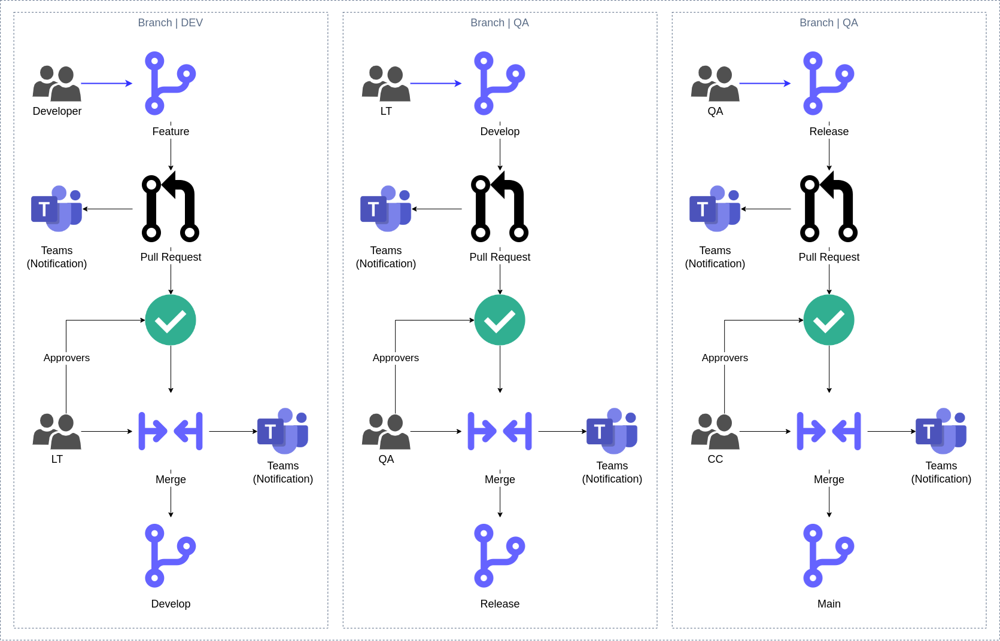
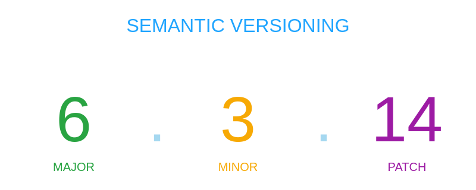

## GitFlow



## Branches

Estandar para el nombre de las ramas ***`feature`***

```bash
feature/ticket-18
# OR
feature/sprint-07
```

Para tener un mapeo y se pueda restrear los commits se debe usar el numero del ***`sprint`*** o el numero del ***`ticket`*** de la tarea.

## Tags



* **`MAJOR`**: DEBE ser incrementada solamente si se introducen cambios incompatibles con la versión anterior. Este PUEDE incluir cambios de nivel menor y parches. Las versiones ***`PATCH`*** y ***`MINOR`*** DEBEN ser reiniciadas a 0 cuando una versión ***`MAJOR`*** es incrementada.

* **`MINOR`**: DEBE ser incrementada si se introduce funcionalidad nueva y compatible con la versión anterior. Ésta DEBE ser incrementada si se introduce una nueva funcionalidad o mejora en el código. Este PUEDE incluir cambios a nivel de ***`PATCH`***. La versión ***`PATCH`*** DEBE reiniciarse a 0 cuando una versión ***`MINOR`*** se incrementa.

* **`PATCH`**: DEBE ser incrementada si solamente se introducen correcciones de errores compatibles con versiones anteriores. Una corrección de error se define como un cambio interno que corrige un comportamiento incorrecto.

## Changelog

## Commits

Se debe usar el siguiente formato para el nombre de los ***`commits`***:

```
<type>: <subject>
```

#### ***`Samples`***

```
test: se agregaron múltiples módulos para probar la aplicación
```

```
fix: excede rate limit
```

#### ***`Type`***

Debe ser uno de los siguientes:

* **`build`**: Cambios que afectan el sistema de compilación o las dependencias externas (gulp, broccoli, npm).
* **`ci`**: Cambios en archivos y scripts de configuración de CI (CodePipeline, Terraform, Script Bash).
* **`docs`**: Cambios en la documentación.
* **`feat`**: Una nueva característica.
* **`fix`**: Una corrección de errores.
* **`perf`**: Un cambio de código que mejora el rendimiento.
* **`refactor`**: Un cambio de código que no corrige un error ni agrega una característica.
* **`style`**: Cambios que no afectan el significado del código (espacios en blanco, formato, falta de punto y coma, etc).
* **`test`**: agregar o corregir pruebas.

#### ***`Subject`***

El asunto contiene una descripción breve del cambio:

* Utilizar el imperativo, tiempo presente: "cambiar" no "cambiado" ni "cambios".
* No escribas en mayúscula la primera letra.
* Sin punto ***`(.)`*** al final.

## Pull Request

Se debe usar el formato de nombres de ***`commits`*** y utilizar la siguiente plantilla para el contenido:

```
## Descripción

<-- Agrega una descripción del user story !-->

## Tipo de cambio

Selecciones las opciones relevantes:

- [ ]  Bugfix
- [ ]  Feature
- [ ]  Refactoring
- [ ]  Tests
- [ ]  Documentation
- [ ]  CI
- [ ]  Other

## Checklist

Selecciones las opciones relevantes:

- [ ]  Compilación correcta.
- [ ]  Documentación actualizada.
- [ ]  Las pruebas unitarias fueron exitosas.
- [ ]  Las pruebas funcionales fueron exitosas.
- [ ]  No se han encontrado problemas en el entorno previo.
- [ ]  El propietario del producto ha aprobado el lanzamiento.
```

#### ***`Recomendaciones`***

- No mas de 50 commits por cada pull request.
